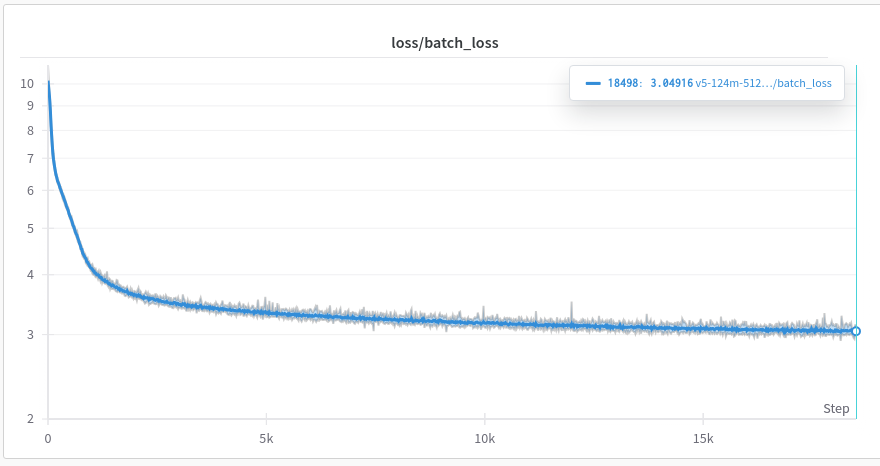
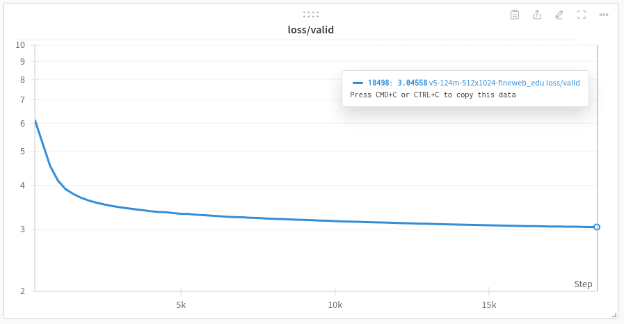

# Pre-training GPT-2 Model

This repository is an attempt to pre-train GPT-2 model from scratch and explore how to scale up the training process using TPU via PyTorch/XLA.

## Getting started

Start by cloning the repository:

```bash
git clone https://github.com/minhnguyent546/pre-training-gpt2.git
cd pre-training-gpt2
```

The next step is to set up the environment, for example, using Python venv:
```bash
python -m venv .venv
source .venv/bin/activate
pip install -r requirements.txt

# or if you want to train on CUDA with torch_xla
pip install -r requirements-xla_cuda.txt

# or on TPU with torch_xla
pip install -r requirements-xla_tpu.txt
```

## Running pre-training

### Preparing the dataset

Run the following script to download and tokenize the [Fineweb](https://huggingface.co/datasets/HuggingFaceFW/fineweb) or [Fineweb-Edu](https://huggingface.co/datasets/HuggingFaceFW/fineweb-edu) dataset (10BT split):
```bash
python scripts/prepare_fineweb.py \
    --seed 1061109567 \
    --tokenizer gpt2 \
    --shard-size 100000000 \
    --output-dir ./fineweb_10BT \
    --num-workers 4
```

You will need approximately 80 GiB space on disk to download and process the dataset, plus 20 GiB for tokens files, leading to roughly 100 GiB on total.

### Training

To train the model, you can run:
```bash
python run_pretrain.py \
    --checkpoints-dir ./checkpoints \
    --seed 1061109567 \
    --train-dir ./fineweb_10BT/train \
    --valid-dir ./fineweb_10BT/test \
    --vocab-size 50304 \
    --seq-length 1024 \
    --d-model 768 \
    --num-layers 12 \
    --num-heads 12 \
    --d-ff 3072 \
    --activation gelu \
    --tie-weights \
    --wandb-logging \
    --wandb-project pre-training-gpt2 \
    --wandb-name gpt2-124m \
    --wandb-logging-interval 100 \
    --optim-type adamw \
    --learning-rate 0.0006 \
    --betas 0.9 0.95 \
    --weight-decay 0.1 \
    --decay-method cosine \
    --warmup-steps 750 \
    --min-lr 0.00006 \
    --decay-steps 20000 \
    --train-batch-size 256 \
    --eval-batch-size 256 \
    --gradient-accum-step 1 \
    --mixed-precision bf16 \
    --train-steps 20000 \
    --valid-steps 100 \
    --valid-interval 500 \
    --save-interval 1000 \
    --saved-checkpoint-limit 6 \
    --max-grad-norm 1.0
```

Or, for example, if you have a node with 2 GPUs:
```bash
torchrun --standalone --nproc_per_node=2 run_pretrain.py
```

Or run pre-training with XLA devices via torch_xla, e.g. to train on a TPU (tested on TPUv3-8, if you encounter errors when running on Colab's TPUv2-8 or Kaggle's TPUv3-8, you might want to check out [this notebook](https://github.com/pytorch/xla/blob/master/contrib/kaggle/distributed-pytorch-xla-basics-with-pjrt.ipynb) to change some environment variables which can cause some errors):
```bash
PJRT_DEVICE=TPU python run_pretrain_xla.py
    --mp-start-method spawn \
    --use-syncfree-optim
```

You can also use GPU with torch_xla:
```bash
export XLA_REGISTER_INSTALLED_PLUGINS=1
PJRT_DEVICE=CUDA GPU_NUM_DEVICES=2 python run_pretrain_xla.py
    --mp-start-method spawn  # CUDA devices are not visible across processes when using fork
```

You can then run some generation. Here is an example:

```bash
python generate.py \
    --model /path/to/checkpoint.pt \
    --tokenizer gpt2 \
    --seed 42 \
    --max-new-tokens 40 \
    --temperature 0.75 \
    --top-k 40 \
    --top-p 0.95
```

An example input and output from the model:
```
>> I'm a large language model,
I'm a large language model, so I would like to be able to see a real human language. The next step, is to see the human brain in terms of the brain's language, but not the other way around.
```

## Starting from pre-trained checkpoints

You can also leverage pre-trained checkpoints from OpenAI's GPT-2 by specifying `--from-checkpoint`:
```bash
export XLA_REGISTER_INSTALLED_PLUGINS=1
PJRT_DEVICE=CUDA GPU_NUM_DEVICES=2 python run_pretrain_xla.py \
    --do-test \
    --seed 1061109567 \
    --train-dir ./fineweb_10BT/train \
    --valid-dir ./fineweb_10BT/test \
    --vocab-size 50304 \
    --seq-length 1024 \
    --d-model 768 \
    --num-layers 12 \
    --num-heads 12 \
    --d-ff 3072 \
    --activation gelu \
    --tie-weights \
    --matmul-precision high \
    --eval-batch-size 8 \
    --mixed-precision fp16 \
    --valid-steps 500 \
    --mp-start-method spawn \
    --from-checkpoint gpt2
```

Here are some figures from OpenAI's GPT-2 checkpoints:

| Model | Params | loss | PPL |
| --- | --- | --- | --- |
| gpt2 | 124M | 3.297 | 27.03 |
| gpt2-medium | 355M | 3.023 | 20.55 |
| gpt2-large | 774M | 2.888 | 17.96 |
| gpt2-xl | 1.5B | 2.791 | 16.30 |

The images below describe what the loss curves look like when training base model (124M) from scratch on Fineweb-Edu (10BT subset), the training took about 14 hours on Kaggle's TPUv3-8:


