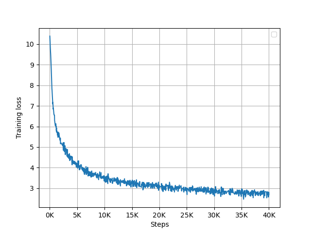

# GPT-2 from scratch

This is a very simple implementation of the GPT-2 model using PyTorch. Some of the ideas and codes are derived from OpenAI's GPT-2 implementation and nanoGPT.

## Getting started

Start by cloning the repository and installing the requirements:

```bash
git clone https://github.com/minhnguyent546/gpt2-from-scratch.git
cd gpt2-from-scratch
pip install -r requirements.txt
```

The configuration file can be found at `config/config.yaml`.

To preprocess the data, simply run the following command:

```bash
python gpt2/preprocess.py --config config/config.yaml
```

After that, we can start training the model:

```bash

python gpt2/train.py --config config/config.yaml
```

## Experiment

The model was trained on [corpus.viwiki](https://github.com/undertheseanlp/corpus.viwiki) (50MB of text extracted from this), the training process took around 4 hours with 40K training steps on Kaggle's P100 GPU.

<center>
    
</center>

Here are some generated text from the model:

```bash
python gpt2/generate.py \
    --model ./checkpoints/gpt2-40000.pt \
    --tokenizer ./checkpoints/tokenizer.json \
    --seed 42 \
    --max-new-tokens 120 \
    --temperature 1

```
results:
```
>> Nghiên cứu là một quá
Nghiên cứu là một quá trình tạo ra các chất hút điện ngoài sự vật chất . Có hai lĩnh vực điện xuất nhằm tạo ra các loại nguyên tử tự nhiên thù của các kim loại - kim loại . Gốc vụ có thể có các loại kim loại như hiđrua liti , Gd và các loại sulfua kim loại khác . Các chất phóng xạ khác gồm các đồng ( 90 %), 1 %, ") [ 25 ] 6H2O ( 20 % tương đương với 66 %.
Các hợp chất ở dạng O2 là hyđrô sulfit ở nhiệt độ thấp , là một trong các điều kiện quan trọng cho sự cháy cháy . Các chất này là nguồn

```

```bash
python gpt2/generate.py \
    --model ./checkpoints/gpt2-40000.pt \
    --tokenizer ./checkpoints/tokenizer.json \
    --seed 42 \
    --max-new-tokens 40 \
    --temperature 0.5

```
results:
```
>> Đầu năm 2021
Đầu năm 2021 , một nhóm hội nghị quốc tế đã được thành lập tại Paris năm 1973 , và cuộc họp này đã được tổ chức bởi các đảng hợp nhất . Năm 1999 , Hội nghị thượng đỉnh thứ nhất được
```
